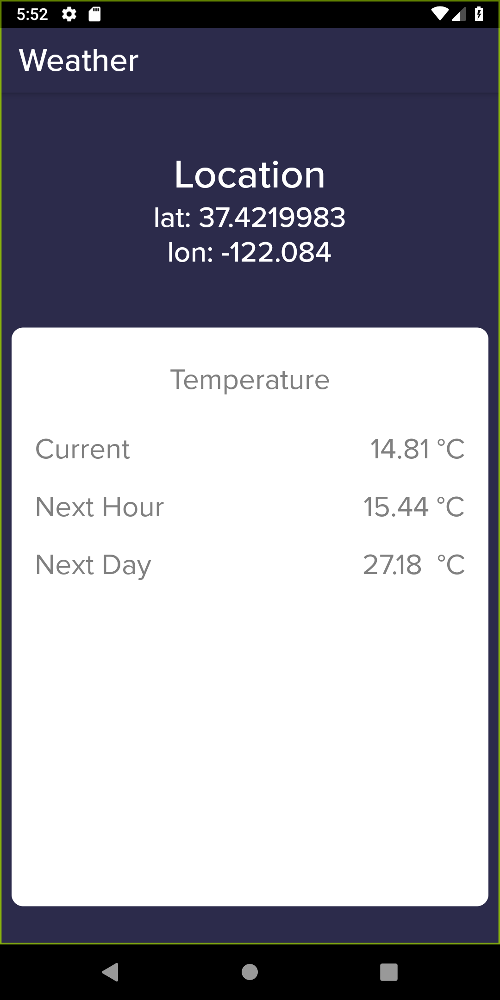

# Weather-App

A Weather App which tell the current temperature of your area by locating the latitude & longitude of the user.

## Technologies Used
- Flutter geoloactor package -> https://pub.dev/packages/geolocator
- Fluuter http package -> https://pub.dev/packages/http
- One call API by openweathermap -> https://openweathermap.org/api/one-call-api

## Screenshots

  
